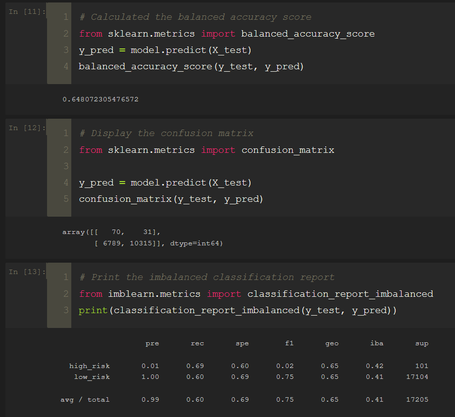
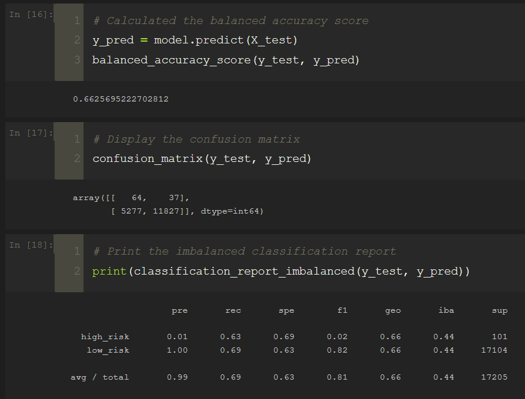
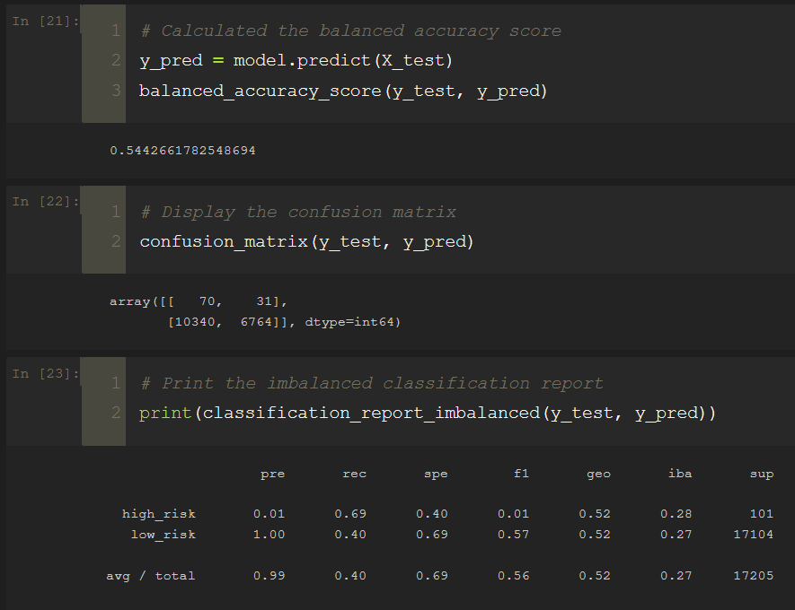
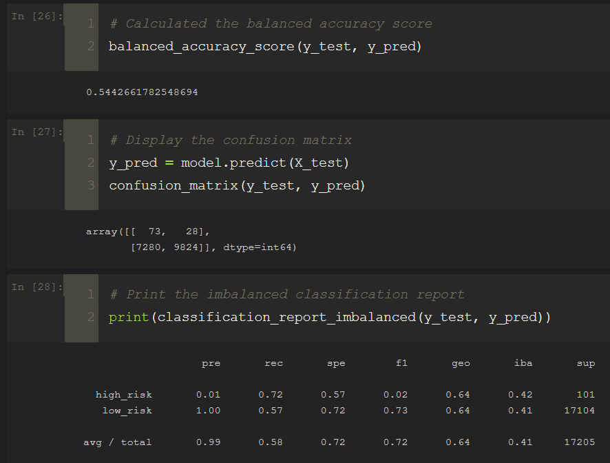
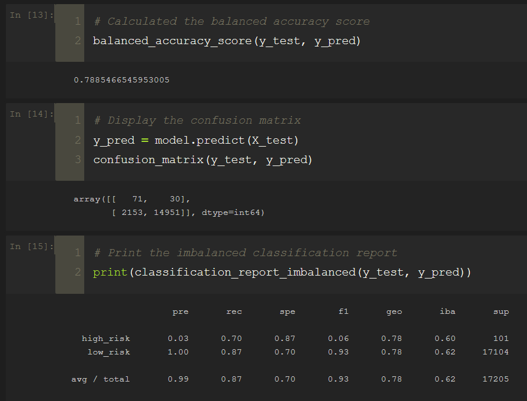
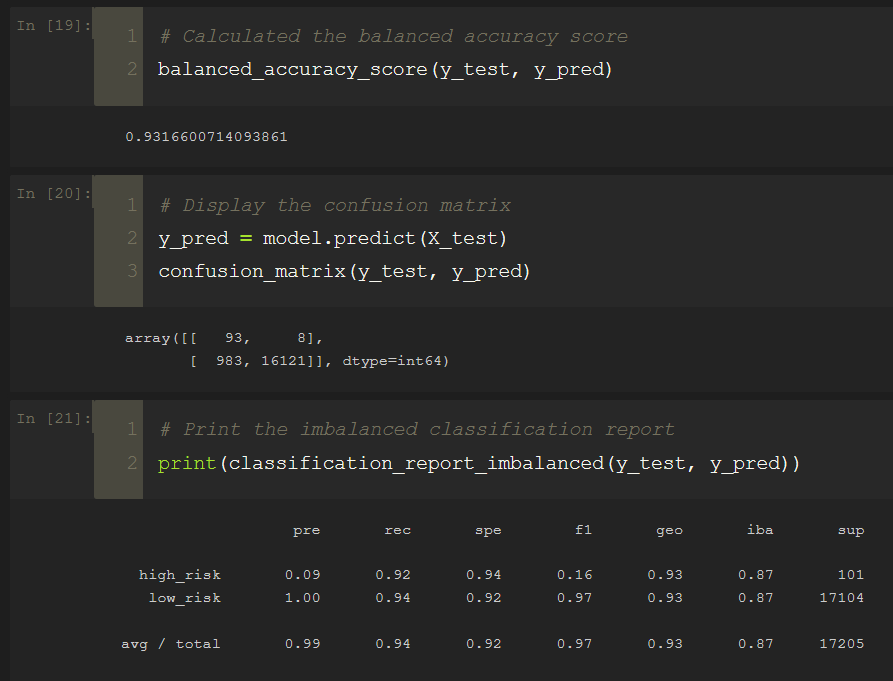

# Credit_Risk_Analysis
Data Analytics Boot Camp - Challenge 17

## Analysis Overview

In this project, we're employing different techniques to train and evaluate models with unbalanced classes. Using imbalanced-learn and scikit-learn libraries to build and evaluate models using resampling.

Using the credit card credit dataset, we’ll oversample the data using the RandomOverSampler and SMOTE algorithms, and undersample the data using the ClusterCentroids algorithm. Then, we’ll use a combinatorial approach of over- and undersampling using the SMOTEENN algorithm. Next, we’ll compare two new machine learning models that reduce bias, BalancedRandomForestClassifier and EasyEnsembleClassifier, to predict credit risk. Once we’re done, we’ll evaluate the performance of these models and make a written recommendation on whether they should be used to predict credit risk.

## Results

1. RandomOverSampler

    - Balanced accuracy score: `0.65`
    - Precision: HR= `0.01` LR= `1`
    - Recall: HR= `0.69` LR= `0.60`

2. SMOTE

    - Balanced accuracy score: `0.66`
    - Precision: HR= `0.01` LR= `1`
    - Recall: HR= `0.63` LR= `0.69`

3. ClusterCentroids

    - Balanced accuracy score: `0.54`
    - Precision: HR= `0.01` LR= `1`
    - Recall: HR= `0.69` LR= `0.40`

4. SMOTEENN

    - Balanced accuracy score: `0.54`
    - Precision: HR= `0.01` LR= `1`
    - Recall: HR= `0.72` LR= `0.57`

5. BalancedRandomForestClassifier

    - Balanced accuracy score: `0.79`
    - Precision: HR= `0.03` LR= `1`
    - Recall: HR= `0.70` LR= `0.87`

6. EasyEnsembleClassifier

    - Balanced accuracy score: `0.93`
    - Precision: HR= `0.09` LR= `1`
    - Recall: HR= `0.92` LR= `0.94`

## Summary

---

